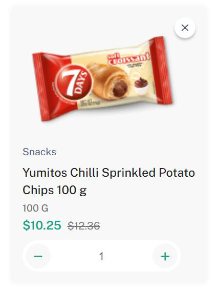
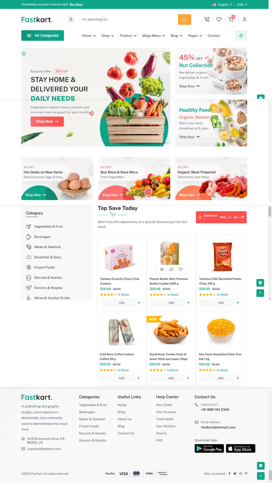
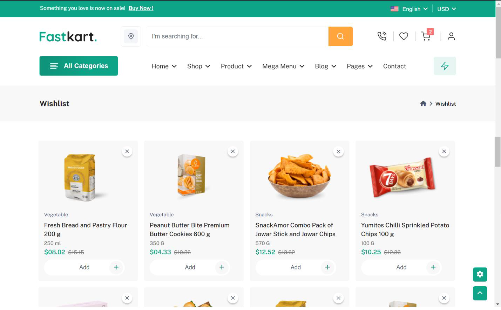
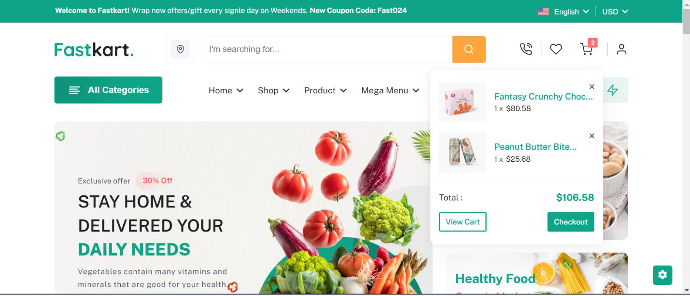
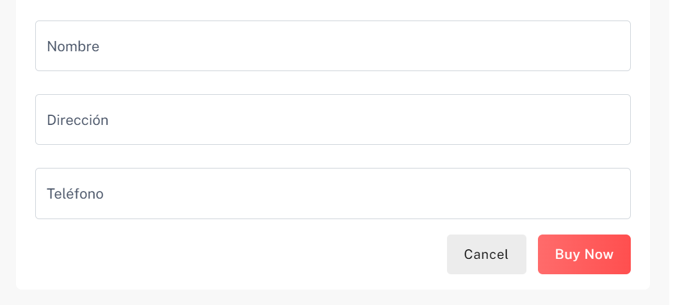

# Proyecto Final Módulo Fundamentos Webs

E-commerce

Objetivo: Crear un e-commerce usando lo aprendido en JavaScript (Eventos DOM, funciones, condicionales, objetos, arreglos, métodos de arreglos, localStorage, promesas, asincronías, peticiones HTTPs, hacer uso de CSS para realizar el diseño responsive).

El proyecto final debe cumplir con los siguientes requerimientos técnicos:
1. Consumir una lista de productos desde un JSON-server
2. Los productos deben aparecer en cards desde la página principal, de esta manera:

3. En la página principal, Filtrar por categoría de productos desde la página principal:

4. Al dar click sobre un botón en la card del producto, debe permitir la opción de agregar a favoritos.

5. Visualizar la página de favoritos
6. Desde la página de favoritos al darle click al corazón en la card del producto, el usuario debe tener la oportunidad de eliminar el producto de favoritos.
7. Agregar productos al carrito
8. Desde el menú, al pasar por encima del ícono del carrito debe permitir ver los elementos agregados e ir al carrito.

9. Desde la página del carrito deben aparecer los productos comprados, y permitir modificar las cantidades o quitar el producto del carrito.

10. El botón "Process To Checkout" debe abrir un formulario, donde permita ingresar: nombre, dirección y teléfono.

11. Desde la página del carrito deben aparecer los productos comprados, y permitir modificar las cantidades o quitar el producto del carrito.
12. Al presionar el botón "Buy Now" debe guardar la compra en un array de compras dentro del Json-Server
13. En una página adicional de administrador, permitir al usuario:
    * Ver productos actuales,
    * Modificar un producto,
    * borrar un producto, y
    * crear un nuevo producto
    * usando JSON-server ver lista de compras de usuarios.
14. La apariencia y estética del aplicativo debe ser fiel al modelo suministrado.
15. Aplicar Responsive desing.
16. Se debe evidenciar el uso:
    * Funciones (arrow functions)
    * Peticiones HTTPs (GET, POST, PUT, PATCH, delete)
    * Condicionales
    * JSON-server
    * Eventos
    * Métodos del DOM HTML
    * Async/Await o .then().catch
    * localStorage

